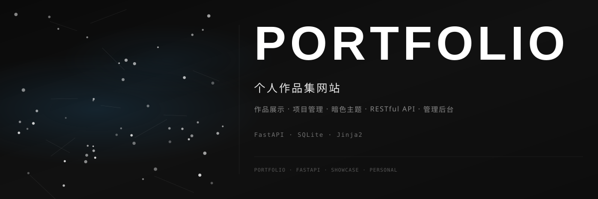

<div align="center">



<br>

### 🎨 个人作品集网站

[](https://github.com/dirjaker/portfolio/stargazers)
[](https://github.com/dirjaker/portfolio/network/members)
[](https://github.com/dirjaker/portfolio/graphs/contributors)
[](https://github.com/dirjaker/portfolio/blob/dev/LICENSE)

</div>

---

## ✨ 功能特性

| 功能 | 描述 |
|------|------|
| 🎨 **多主题系统** | 6 款预设主题（暖日、深夜、晨雾、落日、森林、极光）+ 自定义主题 |
| 📁 **项目展示** | 卡片式项目列表，支持分类、搜索、详情页、访问量统计 |
| 📝 **管理后台** | 完整后台管理：仪表盘、项目 CRUD、拖拽排序、可见性切换 |
| 📊 **数据统计** | 访问量折线图、项目分类饼图、热门项目排行、月度对比 |
| 🖥️ **服务器监控** | 实时 CPU / 内存 / 磁盘使用率展示 |
| 🔌 **RESTful API** | 标准化 API 接口，支持前后端分离 |
| 👤 **个人资料** | 可定制个人介绍、头像上传与裁剪定位、技能展示 |
| 🖼️ **项目详情** | 独立详情页，支持富文本内容与多链接展示 |
| 🔐 **安全认证** | 基于 Cookie 的会话认证，密码哈希存储 |
| 📱 **响应式设计** | 适配桌面端与移动端 |
| 🚀 **静态部署** | 支持 GitHub Pages 静态站点自动生成 |
| 📦 **macOS 打包** | 支持 py2app 打包为 macOS 原生应用 |

## 🚀 快速开始

```bash
# 克隆项目
git clone https://github.com/dirjaker/portfolio.git
cd portfolio

# 创建虚拟环境
conda create -n portfolio python=3.12 -y
conda activate portfolio

# 安装依赖
pip install -r requirements.txt

# 配置环境变量（可选）
cp .env.example .env
# 编辑 .env 修改 SECRET_KEY、管理员账号密码等

# 运行项目
python main.py
```

### 访问地址

| 服务 | 地址 |
|------|------|
| 🌐 前端页面 | http://localhost:10000 |
| 📡 API 文档 | http://localhost:10000/docs |
| 🔧 管理后台 | http://localhost:10000/admin |

### 默认账号

| 项目 | 默认值 |
|------|--------|
| 用户名 | `admin` |
| 密码 | `admin123` |

> ⚠️ 生产环境请务必通过环境变量修改 `SECRET_KEY` 和管理员密码！

## 🛠️ 技术栈

| 层级 | 技术 |
|------|------|
| **后端** | FastAPI + Uvicorn |
| **模板** | Jinja2 |
| **数据库** | SQLite (WAL 模式) |
| **认证** | itsdangerous + passlib |
| **前端** | HTML / CSS / JavaScript |
| **部署** | GitHub Actions + GitHub Pages |
| **打包** | py2app (macOS) |

## 📁 项目结构

```
portfolio/
├── main.py              # FastAPI 主应用，所有路由和视图
├── database.py          # 数据库初始化、表结构、预设主题
├── config.py            # 配置项（环境变量读取）
├── auth.py              # 认证模块（会话管理）
├── requirements.txt     # Python 依赖
├── .env.example         # 环境变量示例
├── assets/              # 项目资源（Banner 等）
├── templates/           # Jinja2 模板
│   ├── base.html        # 基础布局
│   ├── index.html       # 首页（项目列表）
│   ├── project_detail.html  # 项目详情页
│   └── admin/           # 管理后台模板
│       ├── login.html
│       ├── dashboard.html
│       ├── projects.html
│       ├── project_edit.html
│       ├── settings.html
│       └── analytics.html
├── static/              # 静态资源
│   ├── css/style.css
│   └── uploads/         # 用户上传文件
├── packaging/           # macOS 打包脚本
├── docs/                # 项目文档
└── .github/workflows/   # CI/CD 配置
```

## 🔌 API 接口

| 方法 | 路径 | 说明 |
|------|------|------|
| GET | `/api/projects` | 获取所有可见项目列表 |
| GET | `/api/projects/{slug}` | 获取单个项目详情 |
| POST | `/api/view/{slug}` | 记录项目访问量 |
| GET | `/api/profile` | 获取个人资料 |
| GET | `/api/theme` | 获取当前激活主题 |

## 🎨 主题系统

项目内置 6 款精心设计的预设主题：

| 主题 | 风格 | 色调 |
|------|------|------|
| ☀️ 暖日 | 温暖舒适 | 米灰色 |
| 🌙 深夜 | 护眼深色 | 深蓝黑 |
| 🌫️ 晨雾 | 简约干净 | 蓝灰色 |
| 🌅 落日 | 活力暖色 | 橙色调 |
| 🌲 森林 | 自然清新 | 绿色调 |
| 🌌 极光 | 梦幻现代 | 紫蓝色 |

支持在管理后台创建自定义主题，通过 CSS 变量自由调整配色。

## 📝 开发日志

- [x] 暗色主题设计
- [x] 项目展示模块（卡片式 + 详情页）
- [x] 管理后台（仪表盘、项目管理、设置）
- [x] RESTful API
- [x] 响应式布局
- [x] 多主题系统（6 预设 + 自定义）
- [x] 访问统计与数据分析
- [x] 服务器状态监控
- [x] GitHub Pages 静态部署
- [x] 头像上传与定位
- [ ] Markdown 编辑器
- [ ] SEO 优化
- [ ] 多语言支持

## 📄 许可证

[MIT License](LICENSE)

---

<div align="center">

🔗 **GitHub**: [dirjaker/portfolio](https://github.com/dirjaker/portfolio)

⭐ 如果这个项目对你有帮助，请给一个 Star 支持一下！

</div>
